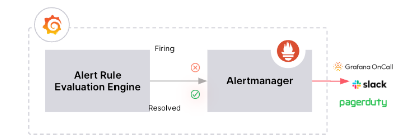
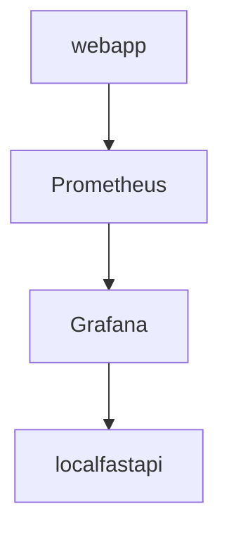

# grafana_contactpoint [WIP]

* [contact point in Grafana](https://grafana.com/docs/grafana/latest/alerting/fundamentals/#contact-points)

Contact Points determine the notification message and where notifications are sent. 
For example, you might have a contact point that sends notifications to an email address, to Slack, to an incident management system (IRM) such as Grafana IRM or PagerDuty, or to a **webhook**.




1. Grafana Alerting periodically evaluates alert rules by executing their data source queries and checking their  conditions.
2. Each alert rule can produce multiple alert instances - one per time series or dimension
3. If a condition is breached, an alert instance fires.
4. Firing (and resolved) alert instances are sent for notifications, either directly to a contact point or through notification policies for more flexibility.

## Setup

### Diagram Arhitecture



* Setup localfastapi

```bash
# install dependencies
python -m venv .fastapivevn
source .fastapivevn/bin/activate
pip install -r requirements.txt
```

* Create `.env` file

```bash
cat<<EOF>.env
TWILIO_ACCOUNT_SID="INSERT_VALUE"
TWILIO_AUTH_TOKEN="INSERT_VALUE"
```

* Start docker containers

```bash
# start services and Build images before starting containers
docker-compose -f docker-compose.yaml up --build -d
docker-compose -f docker-compose.yaml ps

# stop services
docker-compose -f docker-compose.yaml down

# k8s deployment
helm install grafana-hotline ./grafana-hotline --set phone.destinationPhoneNumber="+40...." 

# helm deployment
helm repo add dejanu https://dejanu.github.io/chartsrepo/
helm repo update dejanu
helm search repo dejanu | grep grafana-hotline
```

💻👉 Grafana should be accessible on [localhost:3000](http://127.0.0.1:3000) and Prometheus on [localhost:9090](http://127.0.0.1:9090)

## Grafana contact point config

* Get the web container name `docker ps --format "{{.Names}}"` and API key value `docker logs localfastapi`
* At startup `localfastapi` will generate an API key, used for auth, to be passed in the authorization header: `Authorization: Bearer <your_api_key>`
* Get data from Grafana and send it to an sms gateway/Routing PSTN or VoIP (e.g. [twilio](https://www.twilio.com/docs))

* Create new contact point 💻👉 [here](http://127.0.0.1:3000/alerting/notifications/receivers/new) and add the `SERVICE` coresponding to `localfastapi` container (`docker-compose -f docker-compose.yaml ps` to check container and service names)

### Functionality/Needs to be implemented by `localfastapi` contact point

* Routing phone calls (Routing in the PSTN or VoIP)
* Alert policies
* Manage on-call schedules
* Integrations with tooling (webhooks and stuff)
* Forwarding rules
* Licensing options

## Webapp

* The `webapp` that expose `/metrics` and `/fail` endpoints.
The `/metrics` endpoint is used by Prometheus to scrape metrics, while the `/fail` endpoint simulates a failure by incrementing a gauge and `/success` resets the gauge.

* Check metrics 💻👉 [here](http://127.0.0.1:8081/metrics)
